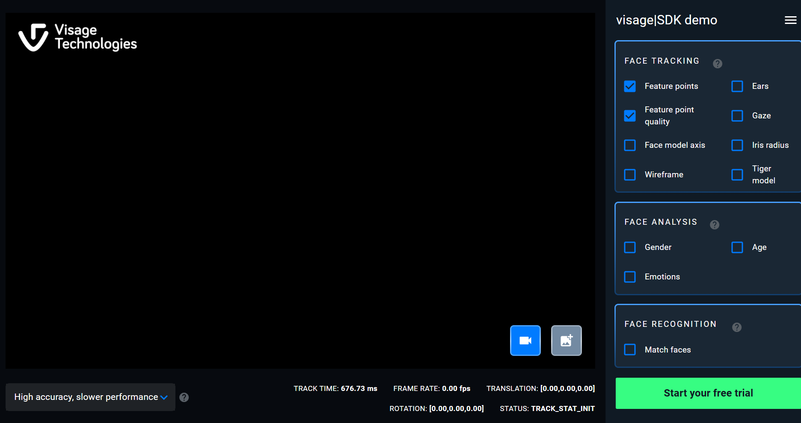

# Application Overview

This project is a demo web application for facial emotion detection using a pre-trained model. We use a hybrid architecture where a React-based front end (bundled with Rspack) provides a dynamic user interface, and a Python-based back end (using Flask or FastAPI) handles the emotion recognition API. The overall deployment strategy leverages free GitHub services and container registries, with a clear upgrade path for advanced features requiring GPU acceleration.

---

## Basic Demo

**Purpose:**  
Provide a simple web interface where users can upload an image and view the detected emotion.

**Features:**

- Users can upload an image from their device.
- The uploaded image is displayed on the left side of the screen.
- The right side shows analysis options (with only "Emotions" enabled) and displays the detected emotion results via progress bars.
  - If only one emotion is detected, its progress bar shows 100%, while others show 0%.
  - Future versions will update the progress bars in real time for more complex outputs.

**UI:**

---

## Advanced Solution (Planned)

*If time permits, we will extend the demo to include:*

- **Real-Time Video Emotion Detection:**  
  - Enable webcam streaming to detect emotions continuously.
  - Update the UI in real time as new frames are processed.

**Inspiration:**  

- [Case Study 1](https://imentiv.ai/blog/)
- [Case Study 2](https://imentiv.ai/case-studies/imentiv-ai-analyzes-football-penalty-takers-emotions-using-image-and-video-emotion-recognition/)
- [Case Study 3](https://www.forasoft.com/blog/article/real-time-ai-emotion-software)

---

## Application Structure

### Front-end

**Technology:**  

- React, bundled with Rspack

**Layout:**

- **Left Column (2/3 width):**  
  - Contains a button to upload an image.  
  - In advanced mode, this column will render a video stream from the client.
  
- **Right Column (1/3 width):**  
  - **Face Analysis Panel:**  
    - Three checkboxes (Gender, Age, Emotions).  
    - For this demo, only "Emotions" is active; Gender and Age are disabled.
  - **Emotion Result Box:**  
    - Displays the detection results for seven emotional states: angry, disgust, fear, happy, neutral, sad, surprised.  
    - Uses progress bars to represent each emotion's confidence level.

### Back-end

**Technology:**  

- Python (Flask or FastAPI)

**Responsibilities:**

- Provide RESTful API endpoints:
  - `/upload`: Accepts image files and returns emotion detection results.
  - `/video_feed` (advanced): Streams video frames for real-time emotion detection.
- Load and run the pre-trained emotion detection model.
- Process incoming images/frames and return a JSON object with emotion percentages.

---

## Application Deployment

**Front-end Deployment:**

- **GitHub Pages:**  
  - The static React application (built using Rspack) will be deployed to GitHub Pages.
  - This is ideal for hosting a simple, single-page UI.

**Back-end Deployment:**

- **Containerized API Service:**  
  - The Python back end is containerized with Docker.
  - The Docker image is stored in GitHub Container Registry (GHCR).
  - For basic mode (CPU-based inference), free-tier platforms such as Koyeb or Render can be used to host the container.
  - For advanced, real-time video processing requiring GPU acceleration, consider:
    - **GCP Free Trial:** $300 credit for GPU-enabled instances.
    - **Oracle Cloud Free Tier:** Occasionally offers free GPU credits.
    - **Hugging Face Spaces:** Offers GPU support under certain limits.
  - Deployment can be managed via GitHub Actions for CI/CD, which builds and pushes the image to GHCR and triggers deployment to the chosen hosting platform.

---

## Cloud Platform Options & Free Tier Considerations

None of the initially considered platforms (Koyeb, Deno Deploy, Codename One, Glitch, Anvil.works, Render) offer free GPU support in their free tiers. For the basic demo, a CPU-based service is sufficient. When upgrading to advanced real-time emotion detection, the following are recommended:

- **GCP Free Trial:** Offers GPU-enabled instances with $300 credit for 90 days.
- **Oracle Cloud Free Tier:** May offer free GPU trials or credits.
- **Hugging Face Spaces:** Can provide GPU support for interactive ML demos under usage limits.

For now:

- **Basic Mode:** Use a free-tier backend (e.g., Render or Koyeb) for CPU inference.
- **Advanced Mode:** Plan to upgrade to a GPU-enabled service (using GCP free trial, Oracle Cloud, or Hugging Face Spaces) as your application scales.

---

## Summary

- **Architecture:** Hybrid approach with a React frontend and a Python backend.
- **Front-end:** Hosted on GitHub Pages.
- **Back-end:** Containerized API stored in GHCR and deployed on a free-tier cloud platform for basic mode; upgrade path available for GPU acceleration.
- **Deployment Tools:** GitHub Actions for CI/CD, GHCR for Docker image storage, and free hosting options (Render, Koyeb, or cloud provider trials) for running the API.

This structure allows us to start with a simple, cost-effective demo while ensuring a clear upgrade path for more advanced, real-time features.
