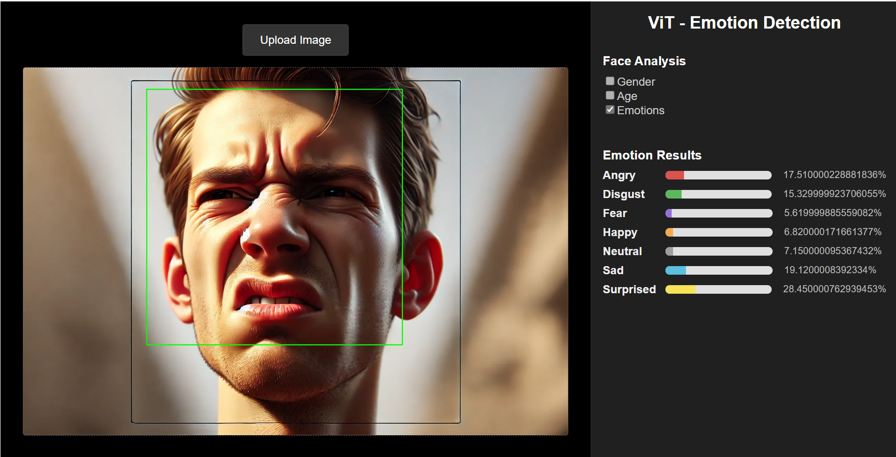
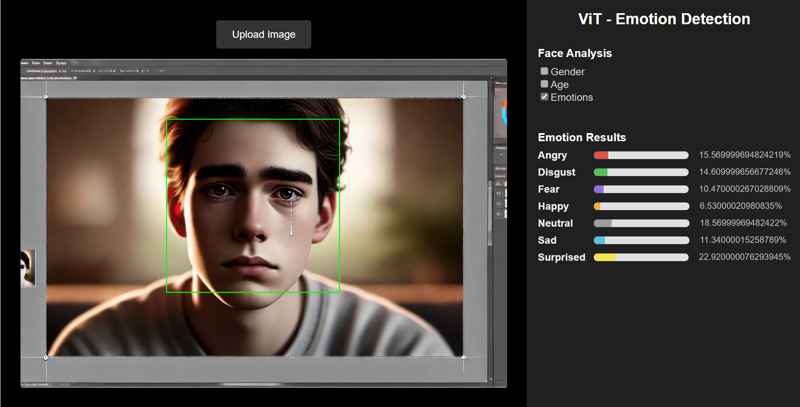
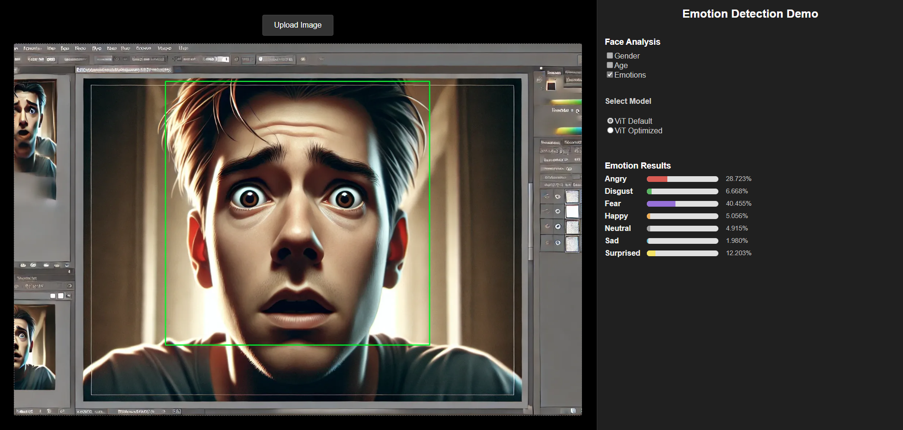
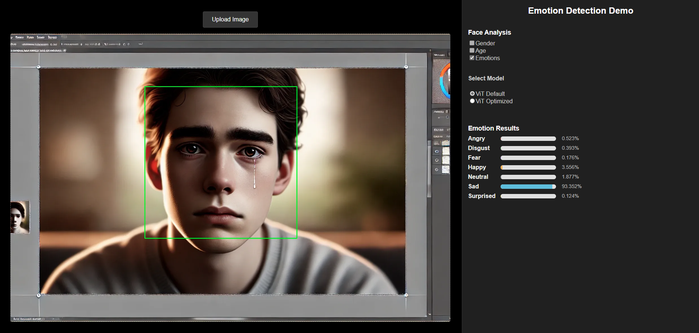

# Emotion Recognition with Vision Transformer (ViT)

This project demonstrates an advanced emotion recognition system built using Google's Vision Transformer (ViT), showcasing transformer-based approaches applied directly to images.

## Project Overview

Emotion recognition is a critical task in human-computer interaction, enhancing user experiences in fields ranging from healthcare to marketing. Our implementation leverages the power of ViT, which transforms images into sequences of patches processed by transformer encoders to achieve state-of-the-art performance in image classification.

### 📌 Project Structure

``` plain/text
├── Application
│   ├── emotion-detection-ui      # Front-end application built with React & rspack
│   └── emotion-services          # Backend services built with FastAPI & PyTorch (ViT model)
├── Training                      # Fine-tuning/Training code with FER-2013 dataset here
└── README.md                     # Main documentation for overall project overview and quick start
```

## 🚀 Quick Start Guide

To run this project, please follow these steps carefully:

### 1. Setup Client (Front-end)

See detailed [Frontend README](./Application/emotion-detection-ui/README.md).

### 2. Setup Server (Back-end Services)

Follow instructions on the [Backend README](./Application/emotion-services/README.md).

### 3. Model Training and Evaluation

Details on model training and evaluation coming soon.

## 🖼️ Results









## 📖 References & Resources

- [Vision Transformer Paper (ViT)](https://arxiv.org/abs/2010.11929)
- [GitHub Repository - ViT Official](https://github.com/google-research/vision_transformer)

## 👥 Team & Contact

- Group 10
  - Nguyễn Duy Anh - 24C15002 - <24C15002@student.hcmus.edu.vn>
  - Nguyễn Phạm Khôi Nguyên - 24C15013 - <24C15013@student.hcmus.edu.vn>
  - Nguyễn Trọng Phúc - 24C15019 - <24C15019@student.hcmus.edu.vn>
  - Hồng Nhất Phương - 24C15051 - <24C15051@student.hcmus.edu.vn>
