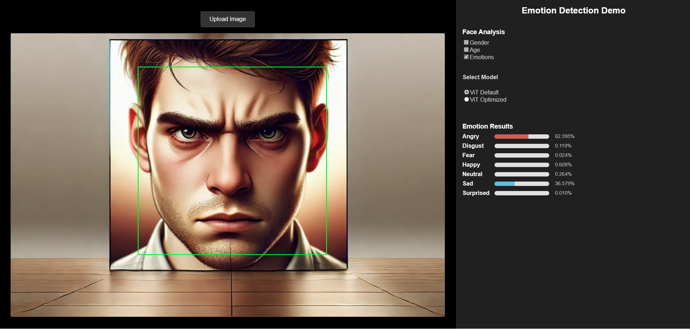

# Emotion Recognition with Vision Transformer (ViT)

This project is all about recognizing human emotions using images—specifically with the help of Google’s Vision Transformer (ViT). It's a modern take on emotion detection, using transformer-based models that analyze images by breaking them into patches, just like words in a sentence.

## What This Project Does

Understanding emotions is key for making smarter, more human-friendly tech. Whether it’s healthcare, marketing, or in your car, detecting how people feel can improve the experience. We’ve built a system that uses ViT to do exactly that—spot emotions in faces with high accuracy.

### 📌 How It's Setup

Here’s a quick look at how everything’s organized:

``` plain/text
├── Application
│   ├── emotion-detection-ui      # Front-end application built with React & rspack
│   └── emotion-services          # Backend services built with FastAPI & PyTorch (ViT model)
├── Training                      # Fine-tuning/Training code with FER-2013 dataset here
└── README.md                     # Main documentation for overall project overview and quick start
```

## 🚀 Getting Started

Here’s how to get the project up and running:

### 1. Setup Client (Front-end)

Head over to the [Frontend README](./Application/emotion-detection-ui/README.md) for setup instructions.

### 2. Setup Server (Back-end Services)

Check the [Backend README](./Application/emotion-services/README.md) for how to start the backend services.


## 🖼️ What It Looks Like

Here are a few snapshots of the system in action:





## 🎯 What We Built — and Why It Matters

We built a real-time **emotion recognition MVP** powered by video streaming and Google's Vision Transformer (ViT).
🎥 [Watch the video demo](https://drive.google.com/file/d/1ejYeT68z1jnLx-gyZPks0DS0VcFzzQpa/view?usp=drive_link)

### 🔧 How It Works

- The **frontend** (React) streams live video from the user's webcam.
- The **backend** (FastAPI + PyTorch) receives video frames, runs them through a ViT model, and returns emotion predictions.
- The system detects emotions like happiness, sadness, surprise, and more — frame by frame — and displays results instantly in the UI.

It’s fast, lightweight, and works locally or on a server. Perfect as a foundation for smarter, emotion-aware applications.

---

But this kind of tech isn’t just cool — it’s already making an impact in the real world.

### 🌍 Real-World Use Cases

**Advertising**  
*Kellogg’s Emotion Analytics*  
Kellogg’s uses emotion recognition to test different ad versions. Viewers’ facial reactions are analyzed to see which ads grab attention — helping marketers improve engagement.

**Healthcare**  
*Monitoring Non-Communicative Patients*  
Hospitals use emotion AI to track the emotional state of patients who can’t speak or show clear expressions, like those with epilepsy or after a stroke — aiding diagnosis and care.

**Automotive**  
*Driver Monitoring by Eyeris*  
In-car emotion detection keeps tabs on the driver’s mood and alertness. If someone’s drowsy or distracted, the system can raise an alert before something goes wrong.

**Sports & Entertainment**  
*Fan Experience in Stadiums*  
Stadiums use emotion tracking to read crowd mood and adjust entertainment in real time — boosting engagement and atmosphere.

**Personal Safety**  
*Epowar App + Smartwatches*  
Epowar combines wearables and AI to detect physical distress (like a spike in heart rate or sudden movement). It can trigger alerts and record events for personal safety.

---

From our MVP to global applications, emotion recognition is already changing how we interact with technology — and each other.


## 📖 References & Resources

- [Vision Transformer Paper (ViT)](https://arxiv.org/abs/2010.11929)
- [GitHub Repository - ViT Official](https://github.com/google-research/vision_transformer)

## 👥 Team & Contact

- Group 10
  - Nguyễn Duy Anh - 24C15002 - <24C15002@student.hcmus.edu.vn>
  - Nguyễn Phạm Khôi Nguyên - 24C15013 - <24C15013@student.hcmus.edu.vn>
  - Nguyễn Trọng Phúc - 24C15019 - <24C15019@student.hcmus.edu.vn>
  - Hồng Nhất Phương - 24C15051 - <24C15051@student.hcmus.edu.vn>
